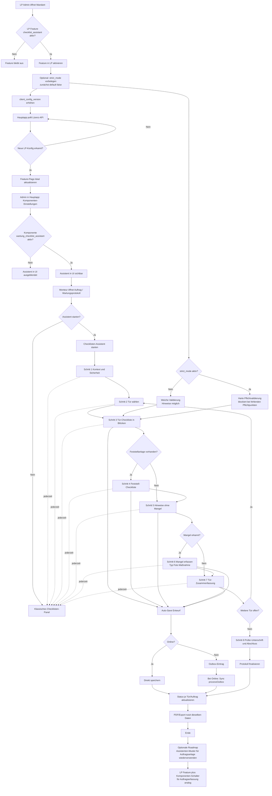
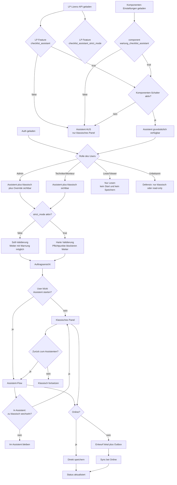

# Konzept: Checklisten-Assistent in der Hauptapp (aktivierbar über LP)

Ziel: Die Wartungs-Checkliste in der Hauptapp als geführten Assistenten anbieten, ohne das bestehende klassische Panel zu verlieren. Die Freischaltung erfolgt zentral über das Lizenzportal (LP) und zusätzlich über die Komponenten-Einstellungen in der Hauptapp.

---

## 1. Leitplanken

- **Aktivierung über zwei Schalter:**
  - LP-Feature `checklist_assistant`
  - Komponenten-Schalter `wartung_checklist_assistant`
- **Optionaler Einstieg:** Assistent ist zunächst optional; klassisches Panel bleibt parallel nutzbar.
- **Fallback jederzeit:** Wechsel Assistent <-> klassisch ohne Datenverlust.
- **Strict-Mode vorbereitet:** LP-Feature `checklist_assistant_strict_mode` ist vorgesehen; initial standardmäßig deaktiviert.
- **Offline first:** Entwürfe lokal sichern; bei Offline in Outbox, danach Sync bei Online.

---

## 2. Aktivierungs- und Ablauf-Flow (Mermaid)

---

## 3. Gating-Matrix (LP x Komponenten x Rolle)

---

## 4. Entscheidungs-/QA-Tabelle

| Fall | LP `checklist_assistant` | Komponenten `wartung_checklist_assistant` | Rolle | `strict_mode` | Erwartung |
|---|---|---|---|---|---|
| 1 | false | false/true | alle | false/true | Assistent aus, nur klassisch |
| 2 | true | false | alle | false/true | Assistent aus, nur klassisch |
| 3 | true | true | Monteur/Techniker | false | Assistent optional, Soft-Validierung |
| 4 | true | true | Monteur/Techniker | true | Assistent optional, harte Pflichtvalidierung |
| 5 | true | true | Admin | false | Assistent + klassisch + Soft-Validierung |
| 6 | true | true | Admin | true | Assistent + klassisch + harte Validierung |
| 7 | true | true | Viewer | false/true | Read-only, keine Schreibaktionen |
| 8 | true | true | unbekannt | false/true | defensiv read-only/klassisch ohne Write |

Zusatzfälle:
- Wechsel Assistent <-> klassisch ohne Datenverlust
- Offline Save -> Outbox -> Online Sync
- Laufzeitänderung der LP-Flags wird nach Polling korrekt übernommen

---

## 5. Teststrategie (Prioritäten)

### P0 (Go-Live-Blocker)
- Feature-Gating LP + Komponenten korrekt
- Optionaler Einstieg Assistent/klassisch
- Strict-Mode (hart) und Soft-Mode korrekt
- Offline/Outbox/Sync stabil
- Kein Datenverlust beim Wechsel Assistent <-> klassisch

### P1 (Stabilität)
- Pfad mit/ohne Feststellanlage
- Mangelerfassung inkl. Foto/Maßnahme
- Mehrtürige Aufträge
- Rollenverhalten (Viewer read-only)
- Laufzeit-Konfigwechsel (LP-Polling)

### P2 (Komfort/Regression)
- UX-Hinweise, Performance
- Regression klassisches Panel
- Konsistenz in PDF/Export

---

## 6. Given/When/Then-Testprotokoll (Template)

Dieses Template kann für jeden Testlauf kopiert werden.

### 6.1 Kopfdaten
- Testlauf-ID
- Datum/Uhrzeit
- Build/Version
- Umgebung (Staging/Prod/Pilot)
- Mandant
- Tester
- Gerät/OS/Browser
- Netzprofil (Online/Offline/instabil)
- LP-Flags (`checklist_assistant`, `checklist_assistant_strict_mode`)
- Komponenten-Schalter (`wartung_checklist_assistant`)

### 6.2 Testfalltabelle

| ID | Priorität | Given/When/Then (Kurzform) | Erwartung | Ergebnis (Pass/Fail/Blocked) | Evidenz | Defect-ID |
|---|---|---|---|---|---|---|
| TC-001 | P0 | LP aus -> Auftrag öffnen | kein Assistent sichtbar |  |  |  |
| TC-002 | P0 | LP an + Komponente aus | kein Assistent sichtbar |  |  |  |
| TC-003 | P0 | LP an + Komponente an | Assistent + klassisch sichtbar |  |  |  |
| TC-004 | P0 | strict=false, Pflicht offen | Soft-Verhalten |  |  |  |
| TC-005 | P0 | strict=true, Pflicht offen | blockiert |  |  |  |
| TC-006 | P0 | Assistent -> klassisch -> Assistent | kein Datenverlust |  |  |  |
| TC-007 | P0 | Offline speichern | Outbox-Eintrag |  |  |  |
| TC-008 | P0 | Wieder online | Sync ok |  |  |  |
| TC-009 | P1 | Tür ohne Feststell | Feststell-Schritt übersprungen |  |  |  |
| TC-010 | P1 | Tür mit Feststell | Feststell-Schritt sichtbar |  |  |  |
| TC-011 | P1 | Mangel erkannt | Mangelpfad korrekt |  |  |  |
| TC-012 | P1 | Mehrere Türen | Navigation/Status korrekt |  |  |  |
| TC-013 | P1 | Viewer | read-only |  |  |  |
| TC-014 | P1 | LP-Flagwechsel zur Laufzeit | UI passt sich nach Polling an |  |  |  |
| TC-015 | P2 | Abschluss/Export | PDF/Export konsistent |  |  |  |
| TC-016 | P2 | klassischer Modus | keine Regression |  |  |  |

### 6.3 Freigabekriterium
- Alle P0-Testfälle grün
- Keine offenen Critical/High-Defects
- Keine Datenverlust-/Sync-Probleme

---

## 7. Nächste Ausbaustufe (optional)

Wenn der Checklisten-Assistent in Pilot/Betrieb positiv bewertet wird, kann das Muster analog auf die Auftragsanlage übertragen werden:
- LP-Feature + Komponenten-Schalter
- optionaler Einstieg statt harter Umstellung
- gleicher Offline-/Outbox-Sync-Ansatz

