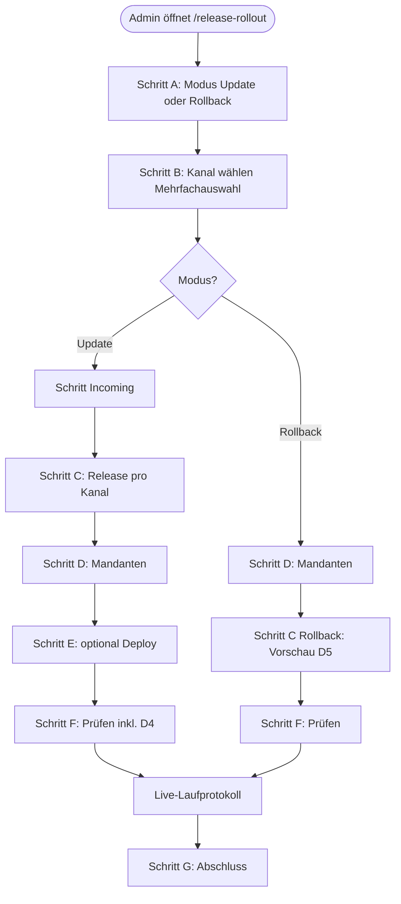

# Konzept: Lizenzportal – Update-Assistent (Vorwärts & Rollback)

Ziel: **Ein** geführter Ablauf im Admin, der **weniger kognitive Last** erzeugt als die heute verteilten Oberflächen – bei **maximaler Wiederverwendung** vorhandener Services und UI-Muster.

---

## 1. Warum es sich „zu komplex“ anfühlt (Ist-Analyse)

| Thema | Wo es heute passiert | Problem für den Betrieb |
|--------|----------------------|-------------------------|
| Release anlegen / freigeben | `/app-releases`, Editor | OK, aber getrennt vom Rollout. |
| Build nach Cloudflare | `ReleaseDeployPanel`, ggf. Editor | Technisch nötig, wirkt wie „zweite Welt“. |
| Go-Live **viele** Mandanten | `ReleaseGoLivePanel` auf `/release-rollout` | Gut – aber ohne Rollback, ohne „Pilot zuerst“. |
| Go-Live / Rollback **ein** Mandant | `MandantForm` → `MandantReleaseAssignmentsSection` | Drei Kanäle × Dropdown + Speichern + Rollback – mächtig, aber nicht derselbe Kopf wie Rollout-Seite. |
| Orientierung | `RolloutChecklistModal` | Nur **lokale** Häkchen, kein durchgängiger Wizard; Deploy/Go-Live passieren **neben** dem Dialog. |
| Rollback **bulk** | — | **Fehlt:** nur pro Mandant/Kanal einzeln. |

**Kern:** Gleiche **Fachaktionen** (Zuweisung ändern, `client_config_version` bump, Audit) stecken in **zwei UX-Paradigmen** („Release zentriert“ vs. „Mandant zentriert“). Der Nutzer muss selbst wissen, **welches** Paradigma gerade passt.

---

## 2. Leitbild: ein Assistent, zwei Richtungen

**Einstieg:** Menüpunkt z. B. **„Update-Assistent“** (oder Umbenennung **„Rollout & Deploy“** zu einem übergeordneten Begriff + Assistent als Hauptinhalt).

**Zwei Modi** (klare Wahl auf Schritt 1):

| Modus | Kurzbeschreibung | Technik (bestehend) |
|--------|------------------|---------------------|
| **Update ausrollen** | Published Release einem Kanal für Mandanten zuweisen (+ optional Deploy-Hinweis) | `assignPublishedReleaseToTenantIds`, `setTenantChannelActiveRelease`, `ReleaseDeployPanel` |
| **Rollback** | Pro Mandant auf **gespeicherten** vorherigen Release für einen Kanal zurück | `rollbackTenantChannelRelease` (pro Mandant; **Bulk-Wrapper neu**) |

**Wichtig:** Rollback ist **pro Mandant** unterschiedlich sinnvoll (jeder hat eigene `previous_release_id`). Ein **Bulk-Rollback** bedeutet: *für jede gewählte Mandanten-ID den einen Schritt ausführen, wenn möglich* – mit Fehlerliste wie beim Go-Live.

---

## 3. Vorgeschlagene Schritte des Assistenten (Wizard)

Die Nummern sind **logische** Schritte; in der UI können **2+3** oder **4+5** auf einer Seite liegen, solange die Reihenfolge klar bleibt.

### Schritt A – Modus

- **„Neues Update zuweisen“** vs. **„Rollback“** (kurze Erklärung: Rollback nur wenn nach letztem Go-Live ein vorheriger Stand gespeichert ist).

### Schritt B – Kanal(e)

- **Haupt-App** / **Kundenportal** / **Arbeitszeitenportal** (Labels wie `RELEASE_CHANNEL_LABELS`).
- **Entscheidung Frage 1:** **Mehrere Kanäle in einem Lauf** (gleiche Mandantenliste, Ausführung pro Kanal mit sichtbarem Fortschritt) **und** bei Bedarf **„Vorgang für anderen Kanal wiederholen“** mit übernommener Mandantenliste (Komfort für Einzelkanal).

### Schritt C – Kontext **Update**

- **Release wählen:** nur `published`, gefiltert nach Kanal B (Liste wie heute auf Rollout-Seite).
- Optional **Kurzinfo:** Version, Titel, `force_hard_reload`, Incoming-Flags (Lesemodus aus `AppReleaseRecord`).

### Schritt C’ – Kontext **Rollback**

- Kein „Ziel-Release“ wählen: System setzt auf **`previous_release_id`**.
- **Vorschau (D5):** **nach Schritt D** (Mandanten fix): Tabelle „Mandant | aktuell | → rollback auf“ für gewählte IDs (`fetchTenantReleaseAssignments` + Release-Metadaten); bei vielen Einträgen Pagination/Filter.

### Schritt D – Mandanten

- **Alle** / **Auswahl** (Checkbox-Liste) – **identisches Muster** wie `ReleaseGoLivePanel`.
- Optional **dritte Option:** **Nur Testmandanten** (`is_test_mandant`), falls ihr das priorisiert (Filter in `fetchTenants` oder clientseitig).
- **D6:** Wenn **Alle** gewählt und Mandantenanzahl **> N** (z. B. 10): **zusätzliche** Bestätigung oder zweistufiger Dialog vor Weiter.

### Schritt E – Deploy (nur Modus Update, optional)

- Wenn gewähltes Release noch **nicht** auf CDN liegen soll: Hinweisbox + eingebetteter oder verlinkter **Deploy** (`ReleaseDeployPanel` / `useReleaseDeployTrigger`).
- **Kontrolle (D4):** In **Schritt F** vor „Ausführen“ ist eine **explizite** Bestätigung nötig: **Deploy geprüft** *oder* **bewusst ohne neuen Build** (mit Kurzwarnung). Nicht „einfach weiterklicken“ ohne eine der beiden Wahlen.

### Schritt F – Prüfen & Ausführen

- **Zusammenfassung:** Modus, Kanal(e), Release-Version **oder** „Rollback“, Anzahl Mandanten, Namen (gekürzt).
- **Bestätigung:** bei **Update** zuerst **D4** (Deploy geprüft **oder** bewusst ohne Build); danach Gesamt-**Bestätigung** (Modal/Checkbox).
- **Live-Laufprotokoll (Pflicht):** Während der Ausführung zeigt die UI **fortlaufend**, was passiert – siehe **Abschnitt 9**. Kein „nur Spinner bis alles fertig“.
- **Ausführung:** bestehende API-Aufrufe (Schleife pro Mandant × Kanal); nach jedem Schritt Zeile im Protokoll (Wartet → Läuft → Erfolg / Übersprungen / Fehler).

### Schritt G – Abschluss

- Die **Ergebnisliste** des Laufs bleibt sichtbar (Zusammenfassung + Detailzeilen).
- **D8:** Bei Fehlern **> 0:** Button **„Nur fehlgeschlagene wiederholen“** (gleicher Kontext, reduzierte Mandantenliste).
- **D11:** **CSV exportieren** + **In Zwischenablage kopieren** (TSV) für die Ergebnisliste des Laufs.
- Link **GitHub Actions** (wenn Deploy in dieser Session ausgelöst).
- Kurztext: **Mandanten-Apps** zeigen Hinweis **Aktualisieren / Später** bzw. Hard-Reload-Gate (Verweis auf `docs/Concept-Mandanten-Updates-und-Rollout-UX.md`).
- Optional: **„Gleichen Vorgang für anderen Kanal wiederholen“** (übernommene Mandantenliste).
- Link **„Im Release-Audit ansehen“** → Seite **Release-Audit**; im Assistenten **eingeklappte** Kurzliste **„Letzte Einträge“** (Frage **6 = C**).

---

## 4. Wiederverwendung bestehender Bausteine (konkret)

| Baustein | Datei / Ort | Nutzung im Assistenten |
|----------|-------------|-------------------------|
| Release-Liste / Record | `fetchAppReleases`, `AppReleaseRecord` | Schritt C |
| Bulk-Zuweisung | `assignPublishedReleaseToTenantIds` | Schritt F (Update) |
| Einzelzuweisung | `setTenantChannelActiveRelease` | weiterhin Mandant-Formular; Assistent nutzt Bulk |
| Rollback | `rollbackTenantChannelRelease` | Schritt F (Rollback), **neu:** Schleife + Aggregat |
| Mandanten laden | `fetchTenants` | Schritt D |
| Deploy | `ReleaseDeployPanel`, `useReleaseDeployTrigger` | Schritt E |
| Kanal-Labels | `RELEASE_CHANNEL_LABELS` | überall |
| Actor | `supabase.auth.getUser()` | wie bisher |
| Checkliste (optional) | `RolloutChecklistModal` | **Entscheidung:** (a) in Assistent integrieren als „Sidebar“ oder letzter Schritt „Checkliste abhaken“, oder (b) verlinken statt doppelt pflegen |

**Neu (minimal):**

- **`rollbackChannelForTenantIds(channel, tenantIds, actorId)`** in `mandantenReleaseService.ts` – analog `assignPublishedReleaseToTenantIds`, Rückgabe `{ updated, errors[] }`.
- **Eine Seite/Route** z. B. `/update-assistent` **oder** Umbau `/release-rollout`, der den Wizard als **Hauptinhalt** rendert und die heutigen Panels **einbettet** statt nebeneinander zu stapeln.

---

## 5. Navigation & Bestandsseiten

**Entscheidung Frage 5:** **`/release-rollout` ist der Assistent** (eine kanonische URL); parallele alte Rollout-Oberfläche wird zurückgebaut, sobald der Wizard die Funktionen abdeckt.

**Zielbild (Frage 3):** Große Teile des bisherigen Update-Prozesses **in den Assistenten** verlagern; verstreute Einstiege **vollständig zurückbauen**, sobald Ersatz da ist.

**Mandant-Formular:** Sektion **„Gestaffelte App-Releases“** nur noch für **Ausnahmen** / bis Migration abgeschlossen; langfristig minimieren oder entfernen und im Assistenten darauf verweisen.

---

## 6. Rollback – fachliche Grenzen (Kommunikation im UI)

- Rollback wechselt nur die **LP-Zuweisung** und **`client_config_version`**; **kein** automatischer Git-Revert auf Cloudflare.
- Wenn das **CDN** schon ein **neueres** Bundle ausliefert, kann der Rollback in der API „ältere“ Release-Metadaten anzeigen, während der Browser noch **neuen** Code hat – das ist dasselbe Grundproblem wie bei „LP vor Build“; der Assistent sollte einen **kurzen Hinweis** tragen (Link SemVer-/Deploy-Doku).

---

## 7. Umsetzungsphasen (empfohlen)

| Phase | Inhalt | Aufwand (grob) |
|-------|--------|----------------|
| **1** | Service `rollbackChannelForTenantIds` + kleine Admin-UI **nur Rollback** (Kanal + Mandanten + Ausführen) zum Testen | klein |
| **2** | Wizard-Route mit Schritten A–D–F für **Update** (Reuse Go-Live-Logik, Release-Auswahl) | mittel |
| **3** | Deploy in Wizard integrieren, Zusammenfassung, Abschluss-Schritt G | mittel |
| **4** | Rollback in denselben Wizard (Moduswahl), Vorschau-Tabelle | mittel |
| **5** | `RolloutChecklistModal` zusammenführen oder ersetzen; Mandanten-Seite nur noch für Sonderfälle dokumentieren | klein–mittel |

---

## 8. Fragenkatalog – Optionen, Empfehlung, **Entscheidung**

| # | Thema | Optionen (Kurz) | Empfehlung (Referenz) | **Entscheidung / Stand** |
|---|--------|-----------------|------------------------|---------------------------|
| **1** | Kanäle pro Lauf | **A** ein Kanal · **B** mehrere Kanäle ein Lauf · **C** ein Kanal + „wiederholen“ mit gleicher Liste | **C**; **B** wenn oft nötig | **B + C** |
| **2** | Rollback ohne `previous_release_id` | **A** still überspringen · **B** als Fehler · **C** eigene Kategorie „Übersprungen“, nicht rot | **C** | **C** (ok) |
| **3** | Incoming / Pilot | **A** nur Editor · **B** Hinweis+Link · **C** eigener Schritt mit Status+Link | **B** oder **C** | **C**; Ziel: Prozess **in Assistent**, alte Punkte **zurückbauen** |
| **4** | Berechtigung | **A** nur Release-Verwalter · **B** jeder LP-Admin · **C** Anzeige für alle, Ausführen nur Verwalter | **A** (bzw. **C** Übergang) | **A**; **Hinweis:** LP hat **noch kein** ausgebautes Rechtesystem → **minimale** Absicherung parallel planen (Profil-Flag o. ä.) |
| **5** | URL / Menü | **A** neue Route + Redirect · **B** `/release-rollout` = Assistent · **C** Übergang mit Banner | **B** bei Konsolidierung | **B** (ok) |
| **6** | Nachvollziehbarkeit **nach** dem Lauf (zusätzlich zum Live-Protokoll) | **A** nur Lauf + DB · **B** + Seite „Release-Audit“ · **C** wie **B** + eingeklappte Kurzliste im Assistenten | **B**; **C** bei häufiger Prüfung ohne Seitenwechsel | **C** |

---

### Frage 6 – **Entscheidung: C**

**Kontext:** Während der Ausführung gilt **immer** das **Live-Laufprotokoll** (Abschnitt **9**).

**Gewählt:** **C** – eigene Admin-Seite **„Release-Audit“** (`release_audit_log`, filterbar), Link nach dem Lauf **„Im Protokoll ansehen“**, plus im Assistenten ein **eingeklappter** Block **„Letzte Einträge“** (Kurzliste, gleicher Daten-Endpunkt wie die Audit-Seite).

---

## 9. Live-Laufprotokoll (verbindliche Anforderung)

- Sobald der Nutzer **Ausführen** bestätigt, zeigt die UI **nicht** nur einen globalen Spinner, sondern ein **laufendes Protokoll**.
- **Pro relevante Zeile** (mindestens: Mandant + Kanal bei Mehrkanal; bei Einzelkanal Mandant): Status **Wartet → Läuft → Erfolg** | **Übersprungen (kein Rollback-Ziel)** | **Fehler** mit Kurztext.
- **Fortschritt:** z. B. „23 / 40“ und optional **pro Kanal**.
- **Technik:** sequentielle oder leicht parallele Aufrufe mit **State-Update nach jedem abgeschlossenen Schritt** (React), damit jeder Schritt sichtbar wird.
- **Nach Abschluss:** die Liste **bleibt stehen** (Ergebnisansicht); unterscheidet sich von der **historischen** Audit-Seite (Frage 6), die **alle** vergangenen Aktionen bündelt.

---

## 10. Verweise

- Mandanten-App-Update-UX (Karten, Reload): `docs/Concept-Mandanten-Updates-und-Rollout-UX.md`
- Zielbild Betrieb: `docs/Update-fuer-Betrieb-in-vier-Schritten.md`
- Fachkonzept Releases: `Vico.md` (Abschnitt zu Mandanten-Releases / §11.20)

---

## 11. Funktionsablauf (Detail, knapp)

**Hinweis:** Beschreibung für Abstimmung und spätere Umsetzung – **kein Code**, bis das **Go** erteilt ist.

### 11.1 Gesamtüberblick (Phasen)

**Detail-Entscheidung D1:** Reihenfolge **C** – nach Kanalwahl **Incoming nur bei Update**; bei **Rollback** kein Incoming-Schritt.

**Incoming-Sichtbarkeit (Produktregel):** Incoming darf in den Mandanten-Apps **nur** erscheinen, wenn der Mandant **Testmandant** ist **oder** in **`release_incoming_tenants`** explizit steht – **nicht** „alle Mandanten“ über `incoming_all_mandanten`. **D9:** **A + B** – Lizenz-API behandelt `incoming_all_mandanten` wie **aus** (nie „alle“ ausliefern); Release-Editor: Feld **deaktivieren/ausblenden** + Kurztext „deprecated“. Optional später **C** (SQL-Bereinigung `false`).

### 11.2 Schrittfolge in einem Satz pro Block

| Block | Aktion (System / Nutzer) |
|--------|---------------------------|
| **A** | Nutzer wählt **Vorwärts** oder **Rollback**; kurzer Hilfetext zu `previous_release_id`. |
| **Incoming** | System lädt für gewählte Kanäle / später gewähltes Release die **Incoming-Flags** (read-only); Links **Release bearbeiten**; kein Schreiben aus dem Assistenten, wenn ihr das vermeiden wollt (sonst später: Toggle mit API). |
| **B** | Nutzer setzt **einen oder mehrere** Kanäle; Validierung: mindestens einer. |
| **C (Update)** | Pro **Kanal** ein **published** Release (Dropdown); wenn nur ein Kanal, ein Release. Abgleich: `release.channel === gewählter Kanal`. |
| **C (Rollback)** | Nach **D** (Mandantenliste fest), **D5:** sofort `fetchTenantReleaseAssignments` für alle IDs; Tabelle **Mandant \| aktiv \| previous-Label \| Status** (z. B. „Rollback möglich“ / „kein Vorversion“); bei Bedarf paginieren. |
| **D** | `fetchTenants`; Umfang **Alle** (alle IDs) \| **Auswahl** (Checkbox) \| optional **nur Test** (`is_test_mandant`). **D6:** bei **Alle** und Anzahl **> N** Extra-Bestätigung oder zweistufig. Liste **session-sticky** für „Wiederholen für anderen Kanal“. |
| **E** | Nur bei **Update**: `ReleaseDeployPanel` oder kompakte Variante; Ergebnis **GitHub-URL** an **G** durchreichen. Vor **Ausführen** (Schritt F): **D4** – Pflichtbestätigung Deploy geprüft **oder** bewusst ohne Build. **Rollback:** Schritt entfällt. |
| **F** | Karten-Zusammenfassung; **Bestätigen**; initialisiert **Protokoll** mit einer Zeile pro **(Mandant × Kanal × Operation)** – bei Rollback Operation = rollback, bei Update = assign. |
| **Run** | Siehe **11.3**. |
| **G** | Statistik **Erfolg / Übersprungen / Fehler**; **D8** / **D11**; Link **GitHub**; **Release-Audit**; **Letzte Einträge** (eingeklappt, Refresh); optional **Kanal wiederholen** mit gleicher Mandantenliste. |

### 11.3 Ausführungsschleife (Run) – Update

Für **jeden gewählten Kanal** `ch` (äußere Schleife, Reihenfolge fest: z. B. main → kundenportal → arbeitszeit_portal):

1. Release-ID `R_ch` aus Schritt C.
2. Für **jeden** Mandanten `t` in `D` (innere Schleife, **sequentiell** für klares Protokoll, oder **Batch 2–3** parallel mit trotzdem einzelner Zeilen-Update):
   - Zeile: **Wartet** → **Läuft**.
   - Aufruf `setTenantChannelActiveRelease(t, ch, R_ch, actor)` *oder* eine neue Batch-Hilfsfunktion, die pro Paar dasselbe tut (bestehende Logik nicht duplizieren).
   - Ergebnis: **Erfolg** \| **Fehler** (Message).
   - Fortschrittszähler global und optional `done_ch / total_ch`.
3. Nach Kanal: optionale **Zwischenzeile** im Protokoll („Kanal X abgeschlossen“).

*Hinweis:* `assignPublishedReleaseToTenantIds(releaseId, tenantIds, actor)` wirkt **ein** Release für **einen** Kanal (Kanal steckt im Release). Für **mehrere Kanäle** entweder **mehrfach** diese Funktion mit je passendem `releaseId` **oder** eine schlanke Orchestrierung, die intern pro Kanal die gleiche Logik nutzt.

### 11.4 Ausführungsschleife (Run) – Rollback

Für jeden **Kanal** `ch`:

1. Für jeden Mandanten `t`:
   - Zeile **Wartet** → **Läuft**.
   - Optional vorher DB-Read: hat `t` auf `ch` eine `previous_release_id`? Wenn **nein**: Zeile **Übersprungen (kein Rollback-Ziel)**, **kein** API-Call.
   - Sonst: `rollbackTenantChannelRelease(t, ch, actor)`.
   - Ergebnis: **Erfolg** \| **Fehler**.

### 11.5 Live-Protokoll (State-Modell)

- **Zeile:** `{ id, mandantId, mandantName, channel?, status: queued|running|ok|skipped|error|cancelled, detail? }`
- **Übergänge:** `queued → running` beim Start des API-Calls; danach einer der Endzustände. **D7:** bei Abbruch verbleibende **queued** → **cancelled** (oder „übersprungen (Abbruch)“).
- **UI:** Liste scrollt mit; laufende Zeile hervorgehoben; Gesamt **n / N**; **Abbrechen**-Button während `running`/zwischen Zeilen. **Abschluss (D11):** CSV + Zwischenablage (TSV).

### 11.6 Audit (Frage 6 = C)

- **Einzelaktionen** schreiben weiterhin wie heute `release_audit_log` (pro `setTenantChannelActiveRelease` / Rollback).
- **Release-Audit-Seite (D10):** `fetchReleaseAuditLog(limit, filter)` mit **Filter Aktion** + **Datumsbereich**; Sortierung neueste zuerst; Limit **N**. Ausbau: Filter Mandant-ID / Release-ID.
- **Assistent „Letzte Einträge“:** gleicher Fetch, `limit` klein (z. B. 10), nach Abschluss des Laufs **Refresh**.

### 11.7 Rechte (Frage 4)

- **Ziel:** ohne Login kein Assistent; Ausführen nur mit **Release-Verwalter**-Flag (sobald in `profiles` o. ä. vorhanden).
- **Bis dahin:** UI-Hinweis in Doku; Route nicht härter als restlicher Admin.

### 11.8 Rückbau (Zielbild Frage 3 / 5)

- Wenn Assistent **feature-complete:** `ReleaseGoLivePanel` / alter Stapel auf `/release-rollout` entfernen; **MandantReleaseAssignmentsSection** reduzieren oder hinter „Erweitert“; **RolloutChecklistModal** in Schritte/Inhalt des Assistenten überführen oder löschen.
- **App-Releases** Liste und **Editor** bleiben für CRUD und Incoming-Pflege.

### 11.9 Mobile & Benachrichtigungen (D12 / D13)

- **Mobile (D12 = B):** Assistent **responsive** (Touch-Ziele, Layout); auf kleinen Viewports **Banner** „Für Rollouts wird Desktop empfohlen“.
- **Benachrichtigungen:** Lange Läufe können im Hintergrundtab enden; **D13** regelt, ob **nur** LP-UI, **Browser-Notification** (opt-in) oder später **E-Mail**.

---

## 12. Detail-Fragenkatalog (iterativ, mit Antworten)

| ID | Thema | Entscheidung |
|----|--------|--------------|
| **D1** | Reihenfolge Incoming vs. Rollback | **C** – Incoming nur bei **Update**, nach Kanalwahl; Rollback ohne Incoming-Schritt. |
| **D1b** | Incoming-Zielgruppe | Nur **Testmandanten** oder **explizit gewählte** Mandanten in `release_incoming_tenants`; kein „alle Mandanten“-Incoming. |
| **D2** | Mehrkanal-Ausführung | **A** – feste Reihenfolge **main** → **kundenportal** → **arbeitszeit_portal** (nur gewählte Kanäle). |
| **D3** | Parallelität pro Kanal (Mandanten) | **A** – MVP **strikt nacheinander**. **Ausbau B:** begrenzte Parallelität (z. B. 3); Umsetzung: Executor von Anfang an mit Parameter **`concurrency`** (Default **1**), damit **B** ohne Umbau der UI-Schleife nachrüstbar ist. |
| **D4** | Deploy vor Go-Live (Update) | **B** – **weiche Sperre:** vor „Ausführen“ muss explizit **eine** von zwei Bestätigungen gesetzt sein: (1) **Deploy geprüft** (z. B. GitHub Actions) *oder* (2) **bewusst ohne neuen CDN-Build**, Risiko verstanden. Optional: Anzeige der **GitHub-URL** aus derselben Session, falls Deploy angestoßen wurde. |
| **D5** | Rollback-Vorschau (Tabelle) | **A** – sobald **Rollback** + **Kanäle** + **Mandanten** feststehen: Vorschau laden und zeigen (bei vielen Mandanten: Pagination/Filter). |
| **D6** | „Alle Mandanten“ | **C** – alle Mandanten aus `fetchTenants` wie heute; **zusätzliche** Bestätigung, wenn **mehr als N** (z. B. **10**) betroffen sind, oder **zweistufiger** Dialog („Alle wirklich?“). Schwellwert **N** konfigurierbar (Konstante / später Einstellung). |
| **D7** | Abbruch während Live-Lauf | **B** – Button **„Abbrechen“**: **keine** weiteren API-Calls; bereits **erfolgreiche** Zuweisungen/Rollbacks bleiben; Rest **ausgelassen**; klarer Hinweis **„teilweise ausgeführt“**; Folgelauf nur noch für **offene** Zeilen sinnvoll (idempotent pro Mandant/Kanal). |
| **D8** | Fehler nach dem Lauf | **B** – Button **„Nur fehlgeschlagene wiederholen“**: gleiche Aktion, gleiche Kanäle/Release-Kontext, nur Mandanten mit **Fehlerstatus** aus dem letzten Lauf (Session-State oder letzte Protokoll-Kopie). |
| **D9** | `incoming_all_mandanten` | **A + B** – **API:** Flag **ignorieren** (Incoming nie global „alle“). **Editor:** Kontrolle **deaktivieren/ausblenden** + Hinweis **deprecated**. Optional **C:** SQL-Bereinigung auf `false` für Alt-Daten. |
| **D10** | Seite „Release-Audit“ (MVP) | **B** – Tabelle (neueste zuerst, Limit **N**) + **Filter** nach **Aktion** und **Datumsbereich** (von/bis). **Ausbau C:** Suche nach Mandanten-ID / Release-ID. |
| **D11** | Export Laufprotokoll | **C** – **CSV-Download** der Ergebniszeilen (Mandant, Kanal, Status, Detail, Zeit) **und** **„In Zwischenablage kopieren“** (TSV für Tabellenkalkulation). |

*(Detailkatalog D1–D11 vollständig. Erweiterung **Mobile** / **Benachrichtigungen**: D12–D13.)*

| ID | Thema | Optionen (Kurz) | Empfehlung | **Entscheidung** |
|----|--------|-----------------|------------|------------------|
| **D12** | **Mobile** (Assistent auf dem Smartphone) | **A** voll responsive · **B** nutzbar + Banner „Desktop empfohlen“ · **C** Sperre „nur Desktop“ | **B** | **B** |
| **D13** | **Benachrichtigungen** nach Bulk-Lauf | **A** keine (nur UI) · **B** optional **Browser-Benachrichtigung** nach Abschluss (Permission) · **C** **E-Mail** an ausführenden Nutzer (später / außerhalb MVP) | **A** MVP; **B** Ausbau | **A** (MVP); **B** Ausbau |

---

*Fragenkatalog §8 vollständig. Umsetzung erst nach **Go**. Live-Laufprotokoll: Abschnitt 9.*
