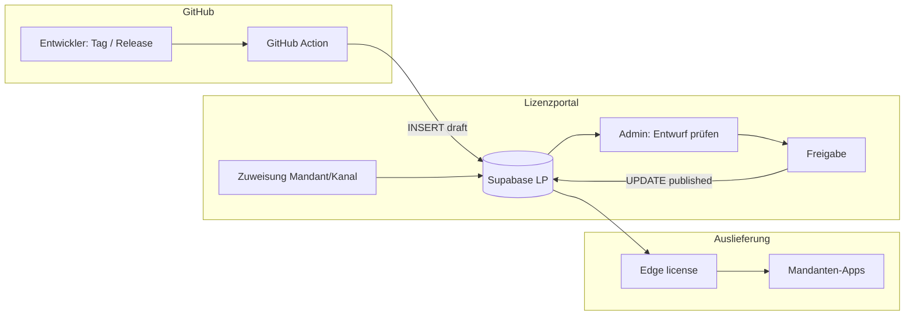
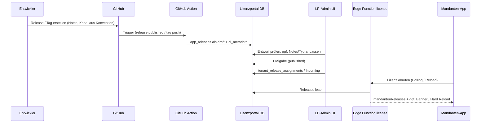
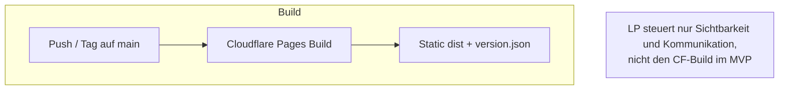

# Planung: Releases aus GitHub → Lizenzportal → Mandanten-Rollout

**Stand:** 2026-04-05 (Doku: Deploy aus LP, Rollout-Seite, §7 Backlog aktualisiert)  
**Ziel:** Beschreibung und Version eines App-Releases entstehen **nachvollziehbar in GitHub**; erscheinen **strukturiert im Lizenzportal**; **Rollout zu Mandanten** bleibt zentral steuerbar (ohne den heutigen manuellen Doppelweg zu verlieren).

---

## 1. Ausgangslage (kurz)

- **Heute:** Releases werden im **Lizenzportal-Admin** (`app_releases`) gepflegt; **Zuweisung** pro Mandant/Kanal in `tenant_release_assignments`; **API** `license` liefert `mandantenReleases`; Apps zeigen Banner / Hard-Reload.
- **Lücke:** Kein fester Bezug zu **Git-Tags / GitHub Releases / Commits**; **Notes** und **Version** können von dem divergieren, was tatsächlich auf **Cloudflare Pages** gebaut wurde.

---

## 2. Leitprinzipien (Empfehlung)

| Prinzip | Begründung |
|--------|------------|
| **GitHub = Quelle für „was wurde gebaut“** | Tag/Release verbindet **Commit/Artefakt** mit **lesbarer Beschreibung** für Menschen und LP. |
| **Lizenzportal = Quelle für „wer sieht was“** | Zuweisung, Incoming, Pilot, Rollback bleiben **mandantenbezogen** und **ohne** Repo-Zugriff der Endnutzer. |
| **Trennung: Metadaten vs. Build** | **Metadaten** (Version, Notes, Kanal) können automatisch ins LP; **Pages-Build** läuft weiter über **Git/CF** (bewährt), optional später **gekoppelt**. |
| **Entwurf vor Live** | Automatische Übernahme aus GitHub erzeugt zuerst **Entwurf**; **Freigabe** im LP verhindert „halbfertige“ Releases bei Mandanten. |

---

## 3. Empfohlene Zielarchitektur (Phasen)

### Phase A – MVP (geringer Aufwand, hoher Nutzen)

1. **Konvention im Repo:** Pro Kanal eindeutige **Git-Tags** oder **GitHub Releases**, z. B.  
   `main/v1.4.0`, `kundenportal/v1.2.1`, `arbeitszeit/v0.9.3`  
   (oder ein Release mit **Label** / Präfix im Titel – wichtig ist **Parsbarkeit** und **1:1 zu Kanal**).

2. **GitHub Action** (bei `release: published` oder `push` von Tags):
   - liest **Tag-Name**, **Release-Body** (Markdown) optional **Commit-Liste**;
   - schreibt in die **Lizenzportal-Datenbank** einen Datensatz in **`app_releases`** mit Status **`draft`** (neues Feld, siehe unten) **oder** nutzt eine kleine Tabelle **`app_release_imports`**;
   - setzt **`ci_metadata`** (jsonb) mit `{ "source": "github", "repo": "…", "tag": "…", "sha": "…", "html_url": "…" }`.

3. **Lizenzportal-Admin:**
   - Liste **„Aus GitHub importiert / Entwürfe“** filtert `draft === true` oder eigene Import-Tabelle;
   - Bearbeiten (Titel, Notes, Tags, Incoming-Flags) wie heute;
   - Button **„Freigeben“** → `draft = false` (oder Status `published`); danach wie bisher nutzbar für **Incoming / Zuweisung**.

4. **Deploy-Realität:**  
   - **Cloudflare Pages:** unverändert **Build bei Push/Tag** (wie heute).  
   - **Lizenzportal** „deployen“ bedeutet im MVP weiterhin: **Mandanten zuweisen** + ggf. **Edge `license`** nur bei API-Code-Änderung.

**Aufwand MVP:** ca. **2–4 Tage** (SQL + RLS, Action, kleine LP-UI-Erweiterung, Secrets).

### Phase B – Komfort

- **Button „Aus GitHub laden“** im LP: Liste der letzten **Releases/Tags** per GitHub API (PAT nur serverseitig / in Action, nicht im Browser-Client).
- **Validierung:** Warnung, wenn LP-Version und letzter CF-Production-Deploy (z. B. über CF API oder feste URL `version.json`) **abweichen**.

### Phase C – Optional (höherer Aufwand)

- **workflow_dispatch** aus LP (Edge Function + GitHub PAT): „Production-Build für Projekt X anstoßen“.
- **Strukturierte Release-Notes** (YAML im Repo) → LP zeigt **Abschnitte pro Modul** (Anschluss an WP-REL-03).

---

## 4. Datenmodell-Erweiterung (Empfehlung)

**Option 1 (minimal):** Spalte in `app_releases`:

- `status` `text` check in `('draft','published')` default `'published'`  
- bestehende Zeilen: Migration auf `'published'`

**Option 2 (strenger):** Tabelle `app_release_proposals` (Import aus GH) → nach Freigabe **Kopie** nach `app_releases`.  
**Empfehlung:** **Option 1** – weniger Duplikatlogik, gleiche UI-Komponenten.

`ci_metadata` (bereits jsonb) für GitHub-Metadaten nutzen; optional Index auf `(channel, (ci_metadata->>'tag'))` für Duplikat-Schutz.

---

## 5. Secrets & Sicherheit

| Secret | Wo | Zweck |
|--------|-----|--------|
| `SUPABASE_LICENSE_PORTAL_URL` + **Service Role** | GitHub Actions (Repo oder Org) | Schreiben `app_releases` / RPC |
| Kein Service Role im Browser-LP | — | nur Admin-Session + Supabase **RLS** wie heute |

**RLS:** Policy so erweitern, dass **nur authentifizierte LP-Admins** `draft` bearbeiten/freigeben; **Service Role** der Action umgeht RLS (typisch insert/update nur über Action, nicht öffentlich).

---

## 6. Funktionsablauf

### 6.1 Überblick (Happy Path)

### 6.2 Sequenz: Von GitHub bis Mandant

### 6.3 Parallel: Frontend-Artefakt (unverändert empfohlen)

---

## 7. Konkrete nächste Schritte (Backlog)

### Erledigt (Stand 2026-04-05)

| # | Thema | Umsetzung (Kurz) |
|---|--------|------------------|
| 1 | **Tag-/Release-Konvention** | In **`scripts/sync-github-release-to-license-portal.mjs`** und Workflow **`.github/workflows/sync-release-to-license-portal.yml`** (`kanal/version`, Aliase); fachlich in **`Vico.md`** §11.20 / Hybrid CI. |
| 2 | **Migration `app_releases.status`** | **`supabase-license-portal.sql`** inkl. Nachzugsblock für bestehende DBs; API nur **`published`** für aktiv/incoming. |
| 3 | **GitHub → LP (Entwurf)** | Workflow **`sync-release-to-license-portal.yml`** + Sync-Skript (Entwurf / Metadaten-Update bei published). |
| 4 | **LP-UI MVP** | Filter Entwürfe/Freigegeben, Freigabe, **`ci_metadata`** im Editor; Mandanten nur **published** bei Go-Live. |
| 5 | **Duplikat-Logik (Import)** | Sync-Skript: gleicher Kanal+Version → Entwurf aktualisieren bzw. bei **published** nur **`ci_metadata`**. |
| 6 | **Production-Deploy aus dem LP** | Edge **`trigger-github-deploy`**, Workflow **`deploy-pages-from-release.yml`** (GHA + Wrangler → Pages); Audit **`release.deploy_triggered`**. Doku: **`docs/Lizenzportal-Setup.md`**, **`Vico.md`** §11.20. |
| 7 | **Rollout-Übersicht (Phase 2)** | Admin **`/release-rollout`**, **`RolloutChecklistModal`**, **`ReleaseDeployPanel`** / **`useReleaseDeployTrigger`**. |

### Offen / optional

1. **Monitoring:** GitHub-Action schlägt fehl → Issue, Slack oder ähnlich (Betrieb).  
2. **Zentrale Build-Env:** GitHub-Secrets pro App durch **ein JSON / Skript** ersetzen (Fragerunde 2, „A dann C“).  
3. **Phase B/C** laut Abschnitt 3 (z. B. „Aus GitHub laden“-Button, Validierung CF vs. LP-Version).

---

## 8. Verknüpfung mit bestehenden Arbeitspaketen

- **WP-REL-00–04:** Rollout- und API-Logik bleibt; diese Planung ergänzt **Quelle der Release-Metadaten**.  
- **WP-REL-03:** strukturierte Notes aus Repo → passt zu **Phase C**.  
- **CF1:** Pages-Build bleibt auf CF; keine Pflicht, LP als Build-Trigger zu nutzen.

---

## 9. Offene Produktentscheidung (kurz)

- Soll ein **ohne Freigabe** importierter Entwurf **niemals** in `mandantenReleases` landen dürfen? → **Empfehlung ja:** API filtert nur `published` für „aktiv/incoming“ sichtbare Releases, oder nur `draft` in separater Admin-Ansicht.

---

**Referenz im Repo:** Mandanten-Releases (`admin` **`/app-releases`**, **`/release-rollout`**, `mandantenReleaseService`, `ReleaseDeployPanel`, `triggerReleaseDeploy`), Edge **`license`** + **`trigger-github-deploy`**, SQL **`supabase-license-portal.sql`** (Abschnitt 7), Workflows **`sync-release-to-license-portal.yml`**, **`deploy-pages-from-release.yml`**.
